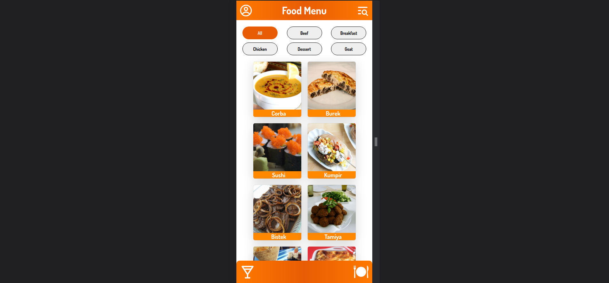

# Sejam bem-vindos ao projeto Recipes App!! 🍔🍹

#### O Recipes App é um aplicativo de culinária cuidadosamente projetado, que oferece uma experiência gastronômica completa. Com a nossa aplicação, os usuários têm a liberdade de escolher entre uma vasta seleção de receitas de bebidas e pratos, adaptadas às suas preferências.

  

## Tecnologias :

<ul>
  <li>HTML</li>
  <li>CSS</li>
  <li>Java Script</li>
  <li>React</li>
  <li>React Router Dom</li>
  <li>React Testing Library</li>
</ul>

## Funcionalidades:

- Possível fazer login apenas e necessário colocar um e-mail com formato válido (Ex: teste@teste.com) e uma senha com mais de 9 caracteres.
- Possível adicionar receitas aos favoritos.
- Possível visualizar histórico de receitas finalizadas.
- Possível escolher entre receitas de bebidas e comidas.
- Possível acompanhar um checklist no decorrer do processo da receita. 

## Como executar:

- Clone em seu computador (via SHH).
- Abra um novo terminal em seu VSCode.   
- Execute o comando para instalar dependências: `npm install`.
- Para incializar execute o comando: `npm start`.

## Também disponível em:

#### Para melhor experiência acesse o site pelo celular ou aperte `F12` em seu teclado e `Ctrl+Shift+M` respectivamente.

### <a href="https://recipes-app-wheat.vercel.app/" ><b>Recipes App</b></a>

## Como contribuir no projeto:
  1. Faça um **fork** do projeto;
  2. Crie uma nova branch com as suas alterações: `git checkout -b my-feature`;
  3. Salve as alterações e crie uma mensagem de commit contando o que você fez: `git commit -m "feature: My new feature"`;
  4. Envie as suas alterações: `git push origin my-feature`;
  5. Abra o seu pull-request na página do GitHub.  

## Licença:

 Esse projeto está sob a licença: 

 

 ##  Autores:

### <a href="https://www.linkedin.com/in/jorge-reis-dev/" ><b>Jorge Wellington.</b></a>

### <a href="https://github.com/angelasamways" ><b>Angela Samways.</b></a>

### <a href="https://github.com/jpedro-assis" ><b>João Pedro.</b></a>
